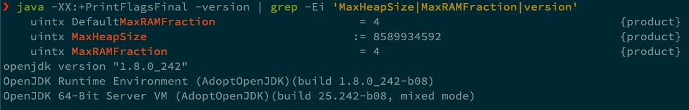
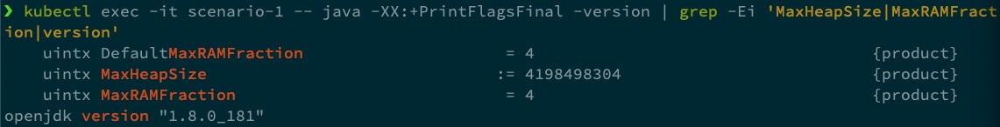
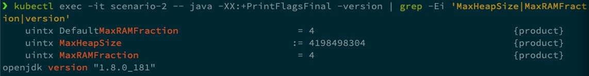
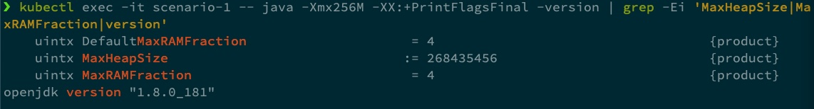

# Managing Java Heap size in Kubernetes

A guide on how to handle `Java` (`jdk8`) heap size for containerised microservices in `Kubernetes`.

## Problem statement

I have come across the topic for this article while managing `Java` microservices in a `Kubernetes` environment for a project where, due to limited access to external software, we were limited to an older `jdk` version. We found that, when using a `jdk` version below `8u191` to containerise `Java` microservices, the `JVM` does not pick up the limit quotas attributed to that container.

Consequently, before going any further, a disclaimer is required: if you are using a `jdk` version `8u191` or above, this article will probably not be relevant to you, but I find these sort of non-perfect world scenarios quite useful and please stick around for the recommendations section even if that is not your case. 

Over the following subsections, I will present a couple of scenarios that illustrate the described topic, as well as a "how to replicate" piece.

### Setup and how to replicate

If you want to verify the scenarios described below in your machine, you'll need the following:

* minikube installed 
* This `git` repository:
    * manifests in k8s/manifests/scenario-*.yml.
    * Cheat sheet bash script -  it will automatically replicate all the results presented below.

You'll need a way to evaluate the maximum `Java` heap size, which can be done using the following command:
```
java -XX:+PrintFlagsFinal -version | grep -Ei 'MaxHeapSize|MaxRAMFraction|version'
```

As I baseline, running the above command in my local machine yields `8589934592 Bytes`, which is `8 Gigabytes`, `25%` of the memory in my machine (`32GB`). 



`25%` is the default `RAM` fraction for the `Java` maximum heap space. This fraction can be changed, which will be further discussed in the recommendations section below.

### Scenario 1: Running a `jdk` version below `8u191` inside unrestricted pod

In the first scenario (all Kubernetes manifest files are in the repository listed in the previous sections under `k8s`), we are running `jdk 8u181` and not imposing any limits.



As we may be expecting, the result for the maximum `Java` heap space is `4198498304 Bytes` (`~4GB`), which is `25%` of the total memory allocated to my docker engine (which is running a `Kubernetes` cluster using `minikube` where this pod is deployed), as we are not imposing any quotas.

### Scenario 2: Running a `jdk` version below `8u191` on a pod with a `1GB` memory limit

When deploying to enterprise `Kubernetes` clusters, good practice dictates we should attribute quotas to our pods/deployments/... (sometimes this is even strongly enforced). To do that, we use a `resources` block in our `Kubernetes` manifest file:

```yaml
      resources:
        limits:
          memory: "1Gi"
        requests:
          memory: "600Mi"
```



In the second scenario (screenshot above), we are also running `jdk 8u181` and, unfortunately, the `JVM` does not pick up the quotas attributed to the pod, which is what motivated this article.

## Solution

Over the following subsections, I will present another couple of scenarios that illustrate the possible solutions.

### Scenario 3: Running `jdk` version `8u191` on a pod with a `1GB` memory limit

The first step is to actually show that this is not an issue if you are running `jdk` version `8u191` or above (again, please stick around for the recommendations section).

The next screenshot features a similar setup (resources block in the manifest file for a pod) but this time running `jdk` version `8u191`.


We can see that the `JVM` detects the limits correctly, attributing a `Java` maximum heap size of `25%` of the memory available to the pod.

### Scenario 4: Running a `jdk` version below `8u191` inside unrestricted pod with `JVM` command line option

If we go back to `jdk 8u181` and have absolutely no option of upgrading, I found that the most reliable way to actually limit the heap size is to compute it and hardcode it into the actual `Java` command in the entrypoint of your container. In this exposé, I simulate that in the `kubectl` command I use to obtain the values, but in a `Dockerfile` it can be done like this:

```dockerfile
...
CMD ["/usr/bin/java", "-Xmx256M", "-jar", "/app.jar"]
```



We can once again conclude that it worked, the `JVM` is using the maximum heap size we specified. However, this is a solution to avoid if possible (if you can upgrade your `jdk`), as it means manual math and hardcoding, two very dangerous words in the DevOps world!

### Alternative solution - experimental parameter

If we take a look at reference [1], there is also mention of an alternative solution: from `JDK 8u131+`, there’s an  experimental `VM` option that allows the `JVM` ergonomics to read the memory values from `CGgroups`. I am not going into detail regarding this solution here but it may be worth taking a look at.

## Conclusions/Recommendations

The previous sections and subsections define the topic at hand and possible isolated solutions. After living through this issue, we were able to update to a later version of `jdk8` and my recommendation is to go for a hybrid solution:

- In a containerised microservice context, using only `25%` of the total container available memory for `Java` maximum heap size is a bit overkill, as the container will not have any other background activities, apart from running the `Java` process and keeping itself alive (specific requirements may contradict this statement). 

- There's another `Java` option that we can use to select the maximum `RAM` fraction for the `Java` maximum heap size. 

- The `StackOverflow` post in reference [2] quotes a `RAM` fraction of `50%` is safe(ish) to start experimenting. We have been using this without any issues thus far.

- That can be achieved also in the container entrypoint, something like:

```dockerfile
...
CMD ["/usr/bin/java", "-XX:MaxRAMFraction=2", "-jar", "/app.jar"]
```

## References

[1] [Java inside docker: What you must know to not FAIL](https://developers.redhat.com/blog/2017/03/14/java-inside-docker/)

[2] [Is -XX:MaxRAMFraction=1 safe for production in a containered environment?](https://stackoverflow.com/questions/49854237/is-xxmaxramfraction-1-safe-for-production-in-a-containered-environment)
