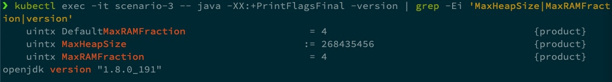

# Managing Java Heap size in Kubernetes

A guide on how to handle `Java Heap` (`jdk8`) size in `Kubernetes`.

## Problem statement

I have come across the topic for this article while managing `Java` microservices in a `Kubernetes` environment and in a project where, due to limited access to external software, we were limited to an older `jdk` version. Consequently, before going any further, a disclaimer is required: if you are using a `jdk` version `8u191` or above, this article will probably not be relevant to you.

### Setup and how to replicated

* minikube installed
* repository link
    * manifests in k8s/manifests/scenario-*.yml
    * Cheat sheet bash script

Command to get java max heap size
```
java -XX:+PrintFlagsFinal -version | grep -Ei 'MaxHeapSize|MaxRAMFraction|version'
```
Running on my local machine I get 8589934592, which is ~8GB, which is ~1/4 of the memory in my machine (`32GB`) - this ratio can also be changed


### Scenario 1: Running a `jdk` version below `8u191` on unrestricted pod

4198498304 bytes ~4GB, which is ~1/4 of the total memory I have allocated to my docker engine (which in turn is running a k8s cluster using minikube, which in turn is running this pod)

### Scenario 2: Running a `jdk` version below `8u191` on a pod with a `1GB` memory limit
Kubernetes good practice dictates we should attribute quotas to our pods/deployments/... if we try to do it using the following the result is exactly the same 

```yaml
      resources:
        limits:
          memory: "1Gi"
        requests:
          memory: "600Mi"
```


I am not going into much detail, for that look at reference, but for jdk version x, the JVM will not be aware of the external limits set by the resources block in your pods/deployments/...


## Solution

### Scenario 3: Running `jdk` version `8u191` on a pod with a `1GB` memory limit
I think it is important to actually show that this is not an issue if you are running `jdk` version `8u191` or above.
If we use the exact same setup (having the resources block in the yaml for a pod with jdk version X), we can see that the JVM is actually able to detect it correctly, having a max heap size of about 1/4 of the memory available to the pod (and )


### Scenario 4: Running a `jdk` version below `8u191` on unrestricted pod with `JVM` command line option
We go back to the pod setup in the first scenario, unrestricted with a jdk version X


### Alternative solution - experimental parameter
Also from [1], it is mentioned that from `JDK 8u131+`, there’s an  experimental `VM` option that allows the `JVM` ergonomics to read the memory values from `CGgroups`, but I am not presenting this solution here, feel free to analyse that reference for more details on that topic.


## References

[1] [Java inside docker: What you must know to not FAIL](https://developers.redhat.com/blog/2017/03/14/java-inside-docker/)